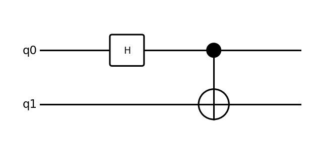
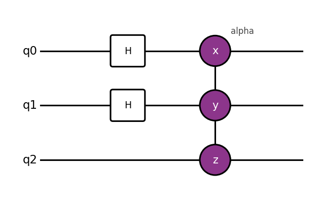
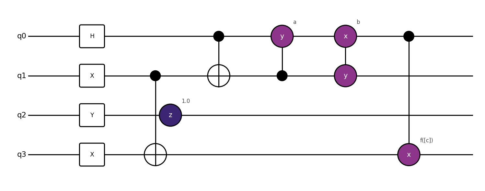
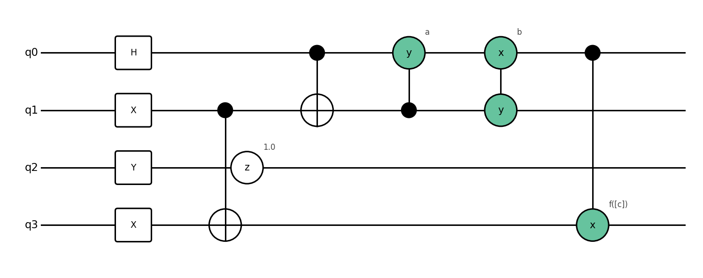
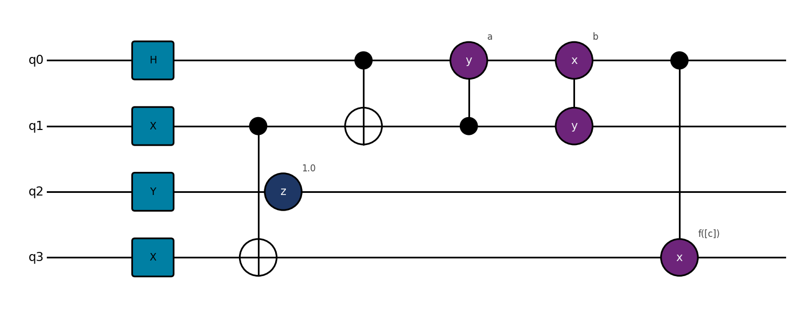
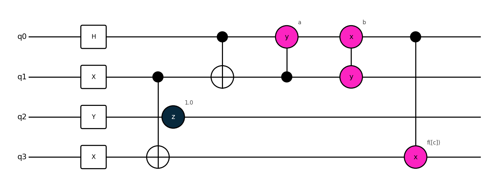

# CircuitVisualizer

A matplotlib-based quantum circuit visualizer for [Tequila](https://github.com/tequilahub/tequila) circuits. Draws gates as styled boxes and circles, handles controlled operations, and annotates symbolic parameters.

## Requirements

```
tequila-basic
matplotlib
```

## FAQ

```python
import tequila as tq
from visualizer import show

circuit = tq.gates.H(0)
circuit += tq.gates.X(target=1, control=0)  # CNOT
show(circuit)
```



## API

```python
show(circuit, filename=None, show_variables=True, style=None)
```

---

## Gate Types

Gates are classified into three visual categories: **logic**, **Pauli rotation**, and **parametrized**. Each category gets its own color in the chosen style.
- Logic Gates: `H`, `X`, `Y`, `Z`, ...  drawn as rectangles
- CNOT gets the special treatment
- Pauli Gates: $e^{-i \frac{\theta}{2} P}$ where $P$ Is a PauliString. Drawn as (connected) circles.

Example:
```python
circuit  = tq.gates.H(0)
circuit += tq.gates.H(1)
circuit += tq.gates.ExpPauli(paulistring="X(0)Y(1)Z(2)", angle="alpha")
show(circuit)
```



---

## Styles

Severall colorstyles available (`unia`, `toronto`, `fai`, `tequila`). Pass the name as a string to `show()`.  
Create your own as simple dictionaries: example
```python
show(circuit, style={"parametrized": "orange", "parametrized_label": "black"})
```
The other keys are:
- `logic`: color for $H,X,Y,Z,S,T$ (non pauli gates)
- `logic label`: font color
- `pauli` color for Pauli gates
- `pauli_label`: font color
- `parametrized`: color for parametrized gates
- `parametrized_label`: font color
---

### `default` / `unia`



---

### `fai`



---

### `toronto`



---

### `tequila`
Same style as the default qpic export



---